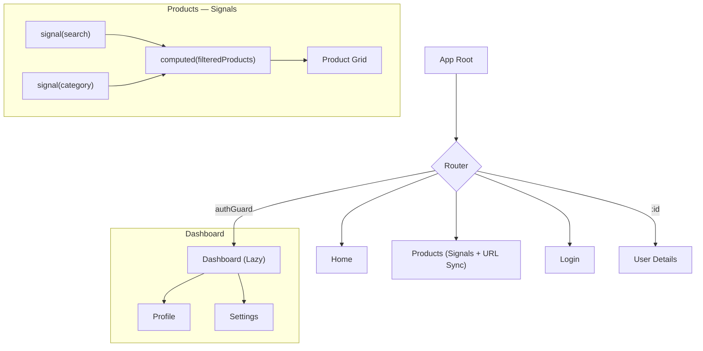

# Angular Dashboard

A high-performance, modular Angular dashboard template built with clean architecture principles.

---

### ⚡ Quick Start

```bash
# Install dependencies
npm install

# Start development server
npm start

# Run unit tests (Vitest)
npm test

# Build for production
npm run build
```

---

### 📂 Architecture



The project follows a **Feature-based Modular** structure:

- **`core/`** — Global singletons (Auth, Guards, Interceptors).
- **`features/`** — Business logic & views (Dashboard, Products, Login, User).
- **`shared/`** — Reusable components, models, pipes, and directives.

---

### 🛠️ Tech Stack

| Tool | Usage |
| :--- | :--- |
| **Angular 21** | Framework & Routing |
| **Angular Signals** | Reactive State |
| **Vitest** | Unit Testing |
| **RxJS** | Async Streams |
| **Prettier** | Code Formatting |

---

### 🔍 Products — Search & Filter with URL Sync

The `/products` page demonstrates **Angular Signals** with URL query parameter synchronization:

| Concept | Implementation |
| :--- | :--- |
| `signal()` | `searchQuery`, `selectedCategory` |
| `computed()` | `filteredProducts` — derived from signals |
| `effect()` | Syncs signal values → URL query params |
| `ActivatedRoute` | Reads URL → signals on page load |

**Try it:** `/products?search=watch&category=Electronics`

---

### 🛡️ Guard Patterns

- **`authGuard`**: Protects the `/dashboard` route. Redirects to `/login` if unauthorized.
- **`LeaveGuard`**: Applied to `/profile`. Prompts user before leaving with unsaved changes.

---

### 🧪 Testing & Quality

- **Unit Testing**: Powered by **Vitest** for component logic and guard verification.
- **Formatting**: **Prettier** ensures consistent code style across the project.

```bash
# Run tests
npm test

# Check formatting
npx prettier --check .
```

---

*Built with ❤️ by [Your Name/Github]*


